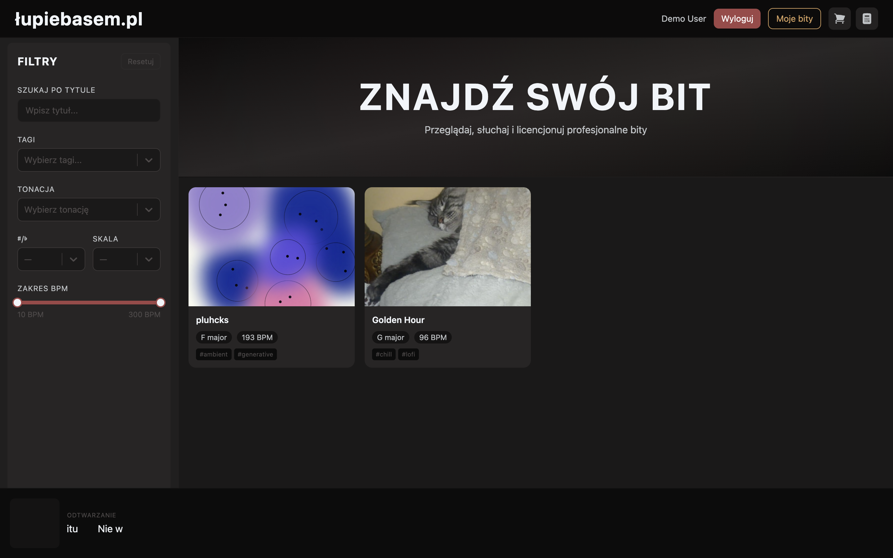
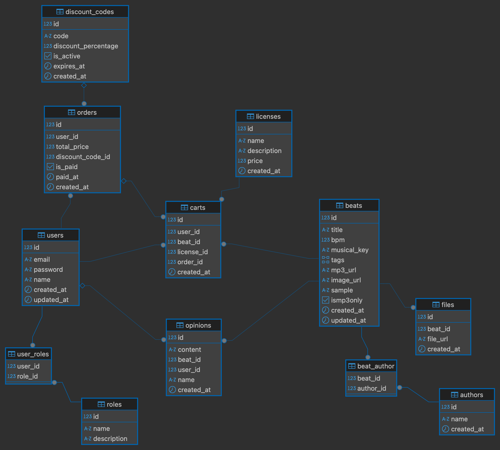
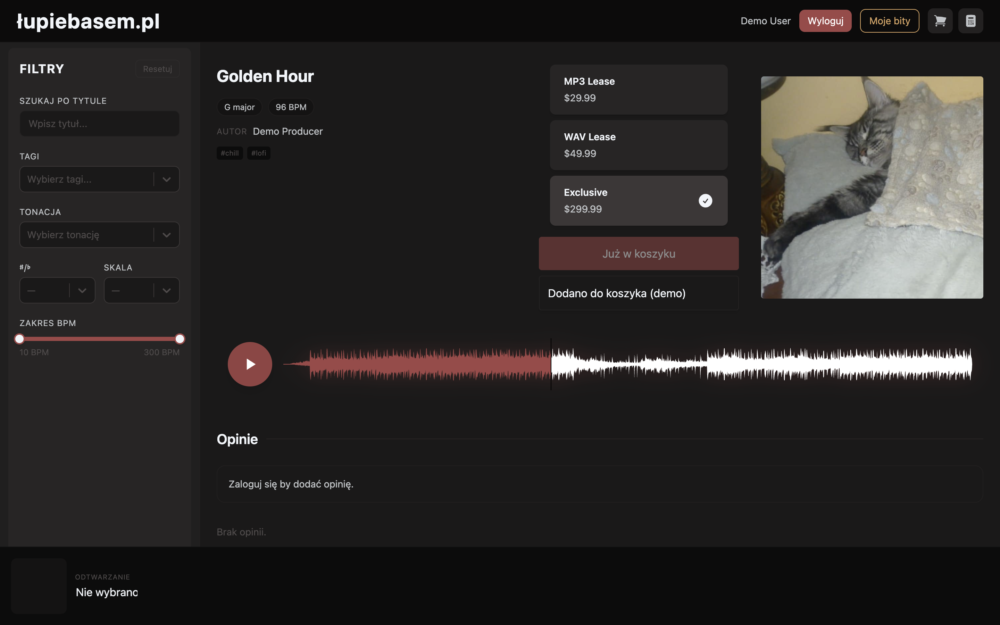

# Project

If hosting is active, you can view it [here](https://projekt-koncowy-sklep.onrender.com/). The backend spins down with inactivity and may take up to a minute to start working again.



## Description

This project is a **beat store** built with the following stack:
- **Backend** using Express.js  
- **Frontend** built with Vite + React + TypeScript  
- **PostgreSQL** database

Additional tools and libraries used:
- [Tailwind CSS](https://tailwindcss.com/)
- [wavesurfer.js](https://github.com/katspaugh/wavesurfer.js)
- [HeadlessUI](https://headlessui.com/)

Currently, the project is hosted using free tiers of:
- [AWS S3](https://aws.amazon.com/s3/) (for file storage)
- [Render](https://render.com/) (for the database, backend, and domain)

### Key Functionalities  
- **User Authentication**: Login and registration.
- **Product Management**: Display of all products with names, descriptions, and categories, along with a search feature.  
- **Product Details**: Detailed view of individual products with options to add reviews.  
- **Shopping Cart**: Add/remove products, calculate totals, and checkout functionality.  
- **Order History**: View past orders and their details.  
- **Admin Panel**: Two-level user permissions (admin can delete all reviews; users can only edit/delete their own).  
- **JWT Authentication**: Secure login with JWT and refresh tokens.

The database schema is as follows:


## Frontend Design

thumpingbass is a robust, no-nonsense e-shop for musicians escaping Beatstars hegemony.

### Color Palette

The UI uses a **warm dark theme**. Background shades run from near-black to dark charcoal with a deliberate brown undertone (`#0d0c0c` → `#4e4a4a`), which reads warmer and more intimate than the cool or neutral greys typical of music platforms. The accent scale completes the warmth with three analogous stops:

| Role | Color | Hex |
|---|---|---|
| Primary CTA / play buttons | Terracotta red | `#A04747` |
| Borders / hover state | Amber | `#D8A25E` |
| Highlight / detail | Warm gold | `#EEDF7A` |

The progression from terracotta through amber to gold keeps the palette cohesive and avoids any cold or clinical feel.

### Layout

The main browse view is a **responsive two-column layout**: a collapsible filter sidebar (25 % width on desktop, stacked full-width on mobile) sits beside a product card grid. The sidebar turns `sticky` below the header on desktop so filters remain visible while scrolling. Auxiliary pages — login, cart, order history — drop the sidebar entirely and render in a single centered column.

### Key UI Patterns

- **Glassmorphism header** — a semi-transparent, backdrop-blurred bar with a hairline border keeps navigation visible without visually dominating content.
- **Persistent media footer** — a fixed player bar lets users preview beats while browsing, with a wavesurfer.js waveform replacing a plain progress bar.
- **Card hover choreography** — cover images scale up, a gradient scrim fades in, and a circular terracotta play button appears, all driven by Tailwind's `group` variant for a polished, zero-JS interaction.

## Setup

To run the project locally, execute the following commands from the root directory:

```bash
cd vite-project
npm install
npm run dev
```

Then, in a new terminal instance:

```bash
cd vite-project/backend
npm install
npm run startdev
```

> The `startdev` script automatically restarts the server when changes are made to `server.js`.

To connect to the database and AWS bucket, create a `.env` file inside `vite-project/` with your credentials, e.g.:

```
PORT=2137
VITE_API_BASE_URL=http://localhost:2137

DB_USER=[your database username]
DB_HOST=[your database host URL]
DB_NAME=[your database name]
DB_PASSWORD=[your database password]
DB_PORT=[your database port]

VITE_AWS_ACCESS_KEY_ID=[your AWS access key]
VITE_AWS_SECRET_ACCESS_KEY=[your AWS secret key]
VITE_AWS_BUCKET_NAME=[your S3 bucket name]
VITE_AWS_REGION=[your S3 bucket region]

JWT_SECRET=some-secret-jwt
```


